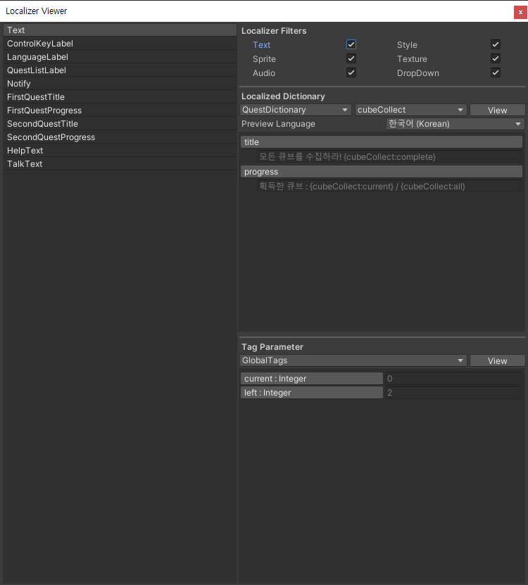

# Localizer Viewer Window

The editor winodw that find **Localizer Objects** in scene and **Localizer Dictionary**, **Tag Parameter Collection** in project at once.

## Localizer Object List

Game Object list that has **Localizer Object** component. It doesn't contain **Tag Formatter**. It selected in hierarchy If select object in list and vice versa.

## Localizer Filters

The type filter displayed in the Localizer Object list. Text is **TextLocalizerObject**, Style is **Text Style Localizer** and **TMP Style Localizer**, Sprite is **Sprite Localizer Object**, Dropdown is **Dropdown Localizer** and **TMP Dropdown Localizer**. Unchecked types are disabled in list.

## Localized Dictionary

Find all **Localized Dictionary** in project. You can preview the **Key Content Pair** with combo box. And focus asset in project by clicking "View" button. Preview language can be changed by preview language.


You can copy full path to the clipboard by clicking the content key in preview.


## Tag Parameter

Find all **Tag Parameter Collection** in project. You can preview the asset with combo box. And focus asset in project by clicking "View" button.


You can copy tag reference to the clipboard by clicking the name of tag in preview.


