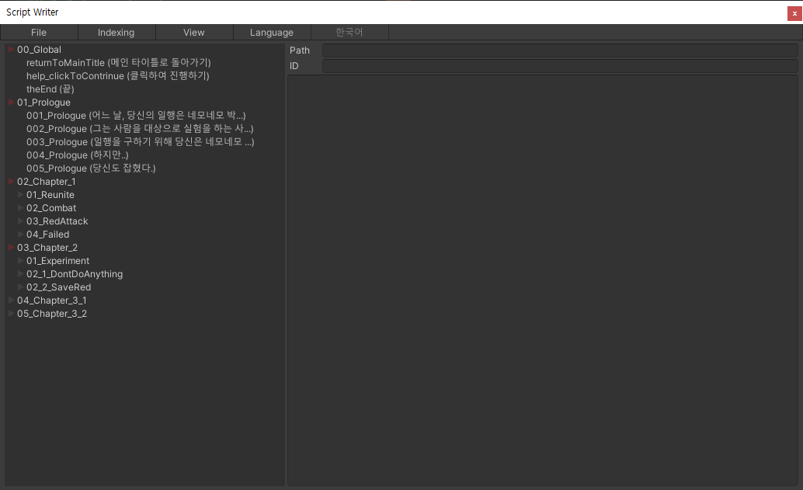

# Script Writer Window

**Script** 및 **Compressed Script**를 추출하기 위한 **Script Writer Node Collection**을 편집할 수 있는 에디터 윈도우 입니다. **Localized Dictionary** 또한 편집하고 추출할 수 있습니다.

## Toolbar

### File

**Script Writer Node Collection** 파일을 저장하거나 엽니다. 또는 Swnc 파일을 임포트하여 병합하거나 **Localized Dictionary**, csv, tsv를 Directory로 임포트할 수 있습니다. **Script, Compressed Script, Localized Dictionary**로 파일을 추출할 수 있습니다.

### Indexing

컨텐츠가 추가될 때 자동적으로 주어지는 id 형식입니다. Area는 인덱스가 결정되는 **Directory** 범위 입니다. Format은 id의 형식입니다. {index}에 인덱스, {id}이 현재 **Directory** 이름이 들어갑니다. Length는 인덱스의 최소 길이 입니다.

| Area |  |
| :--- | :--- |
| Local | 현재 Directory 범위 입니다. |
| Top | 최상위 Directory 범위 입니다. |
| Global | 모든 Directory 범위 입니다. |

### View

Viewer의 표시 형식입니다. 기본 설정은 계층 구조이며 탐색기로 변경하면 전체 경로로 표시된 Content 목록으로 보여집니다. 이 뷰 모드에서는 키워드 검색을 사용할 수 있습니다.

### Language

편집 언어를 변경합니다. 언어는 프로젝트 세팅의 언어 설정을 따르며 LanguageText로 표시됩니다.

## Viewer

Directory 및 Content 노드를 계층 구조로 표시합니다. 우 클릭하여 컨텍스트 메뉴를 열 수 있습니다. 노드를 두 번 이상 클릭하여 열거나 닫을 수 있습니다. 노드가 클릭되면 Editor에 컨텐츠가 표시되며 Content일 경우 편집이 활성화 됩니다.

## Editor

컨텐츠의 id와 내용을 편집할 수 있는 영역입니다. **Directory**는 컨텍스트 메뉴의 Edit을 이용해야 합니다.

