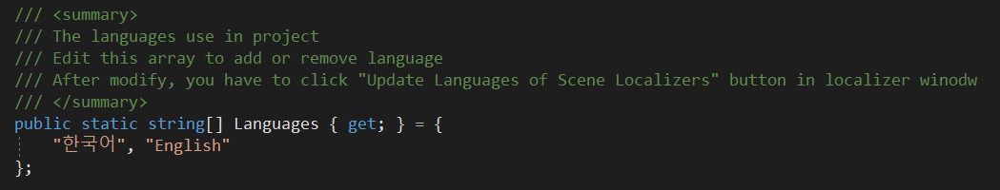

# 초기 설정

## Languages

로컬라이징을 하기 전에 어떠한 언어를 지원해 줄지를 정해야 합니다. 언어 설정을 하기 위해서는 딱 한번 라이브러리 스크립트를 직접 수정해 줄 필요가 있습니다.

_LocalizerPlus - Scripts - Runtime_ 폴더에 있는 _LocalizerManager.cs_ 스크립트를 열어 _Languages_ string 배열에 지원할 언어들을 설정하기만 하면 됩니다.

**Localizer Component**, **Localized Dictionary**, **LString** 및 여러 에디터 윈도우들 모두가 _LocalizerManager.Languages_ 를 참조하여 로컬라이징을 지원하게 됩니다. **일부 기능들은 배열의 각 인덱스들을 참조하도록 되어 있어 가급적 언어를 지우는 행위는 하지 말아야 합니다.** 언어를 추가하는 것에 대해서는 문제가 없습니다.

## 예제 게임

본 에셋에는 예제 씬과 데이터들이 패키지에 포함되어 있습니다. 예제 게임은 렌더 파이프 라인이 적용되지 않은 상태에서 제작되어 있어 URP 혹은 HDRP를 사용하고 있는 경우라면 매트리얼에 문제가 생길 수 있습니다. 이 상태에서 플레이를 하려면 씬의 매트리얼을 업그레이드 하면 됩니다.

**이미 예제를 확인 했거나 불필요하다면 개발에 영향을 줄 수 있으니 Example 폴더를 지우길 바랍니다.**

예제 게임에 대한 자세한 설명은 다음 글 _예제 게임_ 에서 확인하길 바랍니다.

