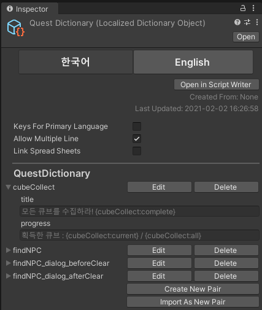
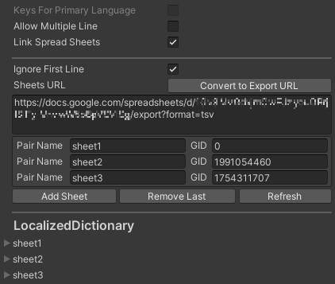

# Localized Dictionary Object

The scriptable object can edit **Localized Dictionary** in the editor. You can edit it with table style or get content from parsed csv, tsv, google spread sheets.

You can create **Localized Dictionary** by _right click - Create - Localizer Plus - Localized Dictionary_ in project, or can export from **Script Writer Window**.

## Scriptable Object



| Editor Only |  |
| :--- | :--- |
| Language Selector | The language of preview. |
| Open in Script Writer | Edit in [Script Writer Window](../editor-window/script-writer-window.md). |
| Created From | Creation source. |
| Last Updated | Last update date. |
| Keys For Primary Language | Use default language content as key. |
| Allow Multiple Line | Use multiple line in editor text edit. |
| Link Spread Sheets | Generate contents from google spreadsheets. |

| Key Content Pair Edit |  |
| :--- | :--- |
| Edit | Open selected [KeyContentPair](localized-dictionary/key-content-pair.md) editor. |
| Delete | Delete selected [KeyContentPair](localized-dictionary/key-content-pair.md). |
| Create New Pair | Add new [KeyContentPair](localized-dictionary/key-content-pair.md). |
| Import As New Pair | Add new [KeyContentPair](localized-dictionary/key-content-pair.md) from csv, tsv, google spread sheets. |

## Key Content Pair Editor


| Toolbar |  |
| :--- | :--- |
| Edit | Open edit menu. |
| Apply | Apply modifications. |
| Revert | Revert last modifications. |
| Cell Width | Set width of cell. |
| Cell Height | Set height of cell. Only enabled when AllowMultipleLine is true. |
| Pair Name | The name of [KeyContentPair](localized-dictionary/key-content-pair.md). |

| Edit Menu |  |
| :--- | :--- |
| Add Key | Add new element. |
| Delete Empty Keys | Delete all elements that has empty key. |
| Sort Keys by  Ascending | Sort keys by ascending. |
| Sort Keys by Descending | Sort keys by descending. |
| Import | Add elements from csv, tsv, google spread sheets. |
| Export | Export current elements to csv, tsv file. |


If Keys For Primary Language is enabled, the first language edit area is disabled and these text will fixed as key value.

By Allow Multiple Line, the editor text area type is changed. When it false, It's text field, and you can move focus to the next control by press tab key. When it true, It's text area, and you can input \t and \n.


## Key Content Pair Importer


<table>
  <thead>
    <tr>
      <th style="text-align:left">Properties</th>
      <th style="text-align:left"></th>
    </tr>
  </thead>
  <tbody>
    <tr>
      <td style="text-align:left">Ignore First Line</td>
      <td style="text-align:left">
        <p>Skip first line conversion if it&apos;s ignoreFirstLine is true.</p>
        <p>(It used when ignore language column.)</p>
      </td>
    </tr>
    <tr>
      <td style="text-align:left">File Type</td>
      <td style="text-align:left">Set file type to csv or tsv.</td>
    </tr>
    <tr>
      <td style="text-align:left">Import Method</td>
      <td style="text-align:left">Set import method to text, file, google spread sheets.</td>
    </tr>
  </tbody>
</table>


In google spread sheets input area, you can input the url and press "Convert" button to convert url to export format. When input the url, copy all link include sheet id \(gid\) and press "Convert". Then you can import it convenient.


## Key Content Pair Exporter


| Properties |  |
| :--- | :--- |
| File Type | Set file type to csv or tsv. |
| Include Language Columns | Add language column to first line. |
| Include Return Character | Include carriage return \(\r\) to new line \(\n\). |
| Enable Content Escape | Save as escaped content. |

## Link Google Spreadsheets

Link Spread Sheets 를 활성화 하면 스프레드 시트의 URL과 여러 시트들의 Pair 이름과 gid를 입력할 수 있는 리스트가 표시됩니다. 원하는 시트들을 gid를 통해 각 내용들을 Key Content Pair로 가져옵니다.



| Properties |  |
| :--- | :--- |
| Ignore First Line | Ignore the first column when get the contents. |
| Sheets URL | Export URL that represented spreadsheets. |

| GID Item |  |
| :--- | :--- |
| Pair Name | The [KeyContentPair](localized-dictionary/key-content-pair.md) name when get sheet. |
| GID | The GID of sheet. |

| Property Edit |  |
| :--- | :--- |
| Convert to Export URL | Convert spreadsheets URL to export format. |
| Add Sheet | Add new GID Item. |
| Remove Last | Remove last GID Item. |
| Refresh | Update the contents based on setting. |


The GID is different in each sheet, and it displayed in the last part of link as "gid={number}" format. Just write only number in the GID value.


## Reference


```csharp
public class LocalizedDictionaryObject : ScriptableObject {
    public KeyContentPair this[int index] { get; }
    public KeyContentPair this[string key] { get; }

    public int Count { get; }

    public bool AddKeyContentPair (KeyContentPair pair) { }
    public int IndexOfPair (KeyContentPair pair) { }
    public void RemovePairAt (int index) { }
    public void RemoveKeyContentPair (KeyContentPair pair) { }
    public void InsertPairAt (int index, KeyContentPair pair) { }
    public bool ContainsPair (string name) { }
    public KeyContentPair GetKeyContentPair (string name) { }
    public bool TryGetKeyContentPair (string name, out KeyContentPair pair) { }
    public void RefreshLanguages () { }
}
```


| Indexer |  |
| :--- | :--- |
| this | Get [KeyContentPair](localized-dictionary/key-content-pair.md) by index or key. |

| Properties |  |
| :--- | :--- |
| Count | Get number of [KeyContentPair](localized-dictionary/key-content-pair.md) has. |

| Functions |  |
| :--- | :--- |
| AddKeyContentPair | Add [KeyContentPair](localized-dictionary/key-content-pair.md). Return false if it's exist. |
| IndexOfPair | Get index of [KeyContentPair](localized-dictionary/key-content-pair.md). |
| RemovePairAt | Remove  [KeyContentPair](localized-dictionary/key-content-pair.md) at index. |
| RemoveKeyContentPair | Remove [KeyContentPair](localized-dictionary/key-content-pair.md). |
| InsertPairAt | Add [KeyContentPair](localized-dictionary/key-content-pair.md) at index. |
| ContainsPair | Get existence of [KeyContentPair](localized-dictionary/key-content-pair.md). |
| GetKeyContentPair | Get [KeyContentPair](localized-dictionary/key-content-pair.md) by key. |
| TryGetKeyContentPair | Get [KeyContentPair](localized-dictionary/key-content-pair.md) by key. Return false if it's exist. |
| RefreshLanguages | Update language settings of [KeyContentPair](localized-dictionary/key-content-pair.md) in list. |

