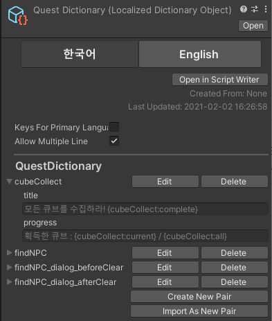
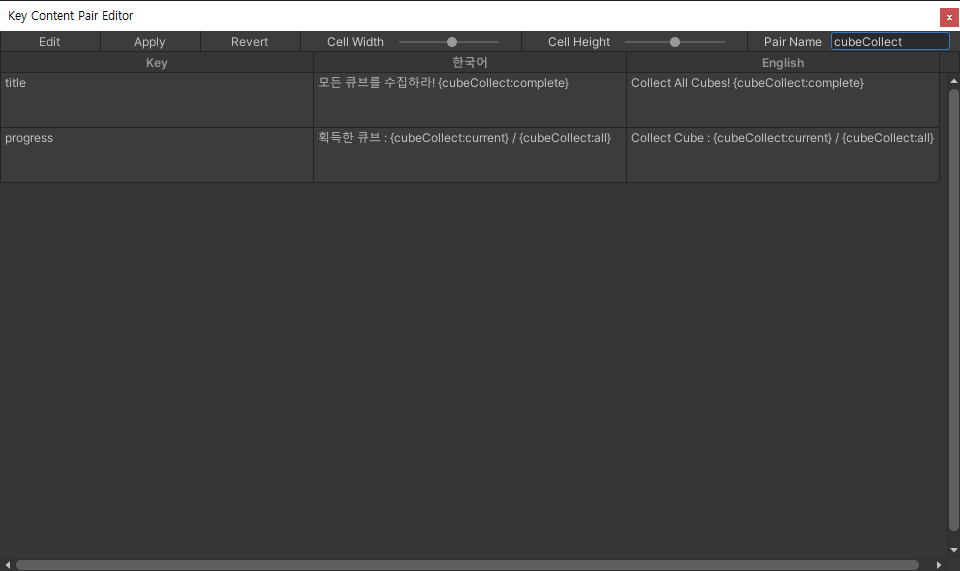
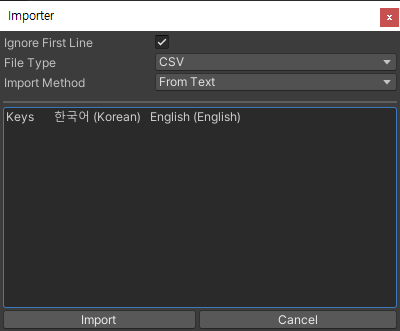
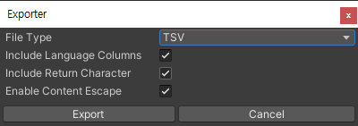

# Localized Dictionary Object

**Localized Dictionary**를 에디터상에서 편집하여 사용할 수 있는 스크립터블 오브젝트입니다. 테이블 형식으로 편집할 수 있으며 csv, tsv, 구글 스프레드 시트로부터 파싱하여 사용할 수 있습니다.

## 스크립터블 오브젝트



| Editor Only |  |
| :--- | :--- |
| Language Selector | 미리보기의 언어 설정입니다. |
| Open in Script Writer | [Script Writer](../editor-window/script-writer-window.md)에서 편집합니다. |
| Created From | 생성 출처입니다. |
| Last Updated | 마지막 업데이트 날짜 입니다. |
| Keys For Primary Language | 기본 언어의 내용을 key 값으로 사용합니다. |
| Allow Multiple Line | 에디터 텍스트 편집의 멀티 라인을 허용합니다. |

| Key Content Pair Edit |  |
| :--- | :--- |
| Edit | 지정된 [Key Content Pair](localized-dictionary/key-content-pair.md) 에디터를 엽니다. |
| Delete | 지정된 [Key Content Pair](localized-dictionary/key-content-pair.md)를 제거합니다. |
| Create New Pair | 새 [Key Content Pair](localized-dictionary/key-content-pair.md)를 추가합니다. |
| Import As New Pair | csv, tsv, 구글 스프레드 시트로부터 새 [Key Content Pair](localized-dictionary/key-content-pair.md)를 추가합니다. |

## Key Content Pair 에디터



<table>
  <thead>
    <tr>
      <th style="text-align:left">Toolbar</th>
      <th style="text-align:left"></th>
    </tr>
  </thead>
  <tbody>
    <tr>
      <td style="text-align:left">Edit</td>
      <td style="text-align:left">&#xD3B8;&#xC9D1; &#xBA54;&#xB274;&#xB97C; &#xC5FD;&#xB2C8;&#xB2E4;.</td>
    </tr>
    <tr>
      <td style="text-align:left">Apply</td>
      <td style="text-align:left">&#xC218;&#xC815; &#xC0AC;&#xD56D;&#xC744; &#xC801;&#xC6A9;&#xD569;&#xB2C8;&#xB2E4;.</td>
    </tr>
    <tr>
      <td style="text-align:left">Revert</td>
      <td style="text-align:left">&#xB9C8;&#xC9C0;&#xB9C9; &#xC218;&#xC815; &#xC0AC;&#xD56D;&#xC73C;&#xB85C;
        &#xB418;&#xB3CC;&#xB9BD;&#xB2C8;&#xB2E4;.</td>
    </tr>
    <tr>
      <td style="text-align:left">Cell Width</td>
      <td style="text-align:left">&#xC140;&#xC758; &#xB108;&#xBE44;&#xB97C; &#xC124;&#xC815;&#xD569;&#xB2C8;&#xB2E4;.</td>
    </tr>
    <tr>
      <td style="text-align:left">Cell Height</td>
      <td style="text-align:left">
        <p>&#xC140;&#xC758; &#xB192;&#xC774;&#xB97C; &#xC124;&#xC815;&#xD569;&#xB2C8;&#xB2E4;.</p>
        <p>Allow Multiple Line &#xC774; true &#xC77C; &#xACBD;&#xC6B0;&#xC5D0;&#xB9CC;
          &#xAC00;&#xB2A5;&#xD569;&#xB2C8;&#xB2E4;.</p>
      </td>
    </tr>
    <tr>
      <td style="text-align:left">Pair Name</td>
      <td style="text-align:left"><a href="localized-dictionary/key-content-pair.md">Key Content Pair</a>&#xC758;
        &#xC774;&#xB984;&#xC785;&#xB2C8;&#xB2E4;.</td>
    </tr>
  </tbody>
</table>

| Edit Menu |  |
| :--- | :--- |
| Add Key | 새 항목을 추가합니다. |
| Delete Empty Keys | Key 내용이 비어있는 항목들을 모두 제거합니다. |
| Sort Keys by  Ascending | Key 값을 기준으로 오름차순 정렬합니다. |
| Sort Keys by Descending | Key 값을 기준으로 내림차순 정렬합니다. |
| Import | csv, tsv, 구글 스프레드 시트로부터 항목들을 추가합니다. |
| Export | 현재 항목들을 csv 또는 tsv 파일로 추출합니다. |

## Key Content Pair Importer



| Properties |  |
| :--- | :--- |
| Ignore First Line | 첫 번째 줄을 무시합니다. \(언어 항목을 무시할 때 사용합니다.\) |
| File Type | csv 혹은 tsv 파일 형식을 지정합니다. |
| Import Method | 텍스트, 파일 또는 구글 스프레드 시트 임포트 방식입니다. |


구글 스프레드 시트 임포트 방식에서 url를 입력하고 Convert를 사용하면 추출 형식의 url로 변환됩니다. url을 입력할 때 시트의 id \(gid\) 까지 주소를 전체 복사 후 입력한 뒤 Convert를 누르고 Import를 하면 편리하게 사용할 수 있습니다.


## Key Content Pair Exporter



| Properties |  |
| :--- | :--- |
| File Type | csv 또는 tsv 파일 형식을 지정합니다. |
| Include Language Columns | 첫번 째 줄에 언어 컬럼을 추가합니다. |
| Include Return Character | 새 줄 \(\n\)에 캐리지 리턴 \(\r\) 을 포함합니다. |
| Enable Content Escape | Escape된 내용으로 저장합니다. |

## 레퍼런스


```csharp
public class LocalizedDictionaryObject : ScriptableObject {
    public KeyContentPair this[int index] { get; }
    public KeyContentPair this[string key] { get; }
    
    public int Count { get; }
    
    public bool AddKeyContentPair (KeyContentPair pair) { }
    public int IndexOfPair (KeyContentPair pair) { }
    public void RemovePairAt (int index) { }
    public void RemoveKeyContentPair (KeyContentPair pair) { }
    public void InsertPairAt (int index, KeyContentPair pair) { }
    public bool ContainsPair (string name) { }
    public KeyContentPair GetKeyContentPair (string name) { }
    public bool TryGetKeyContentPair (string name, out KeyContentPair pair) { }
    public void RefreshLanguages () { }
}
```


| Indexer |  |
| :--- | :--- |
| this | 인덱스 또는 키를 통해 [KeyContentPair](localized-dictionary/key-content-pair.md)를 가져옵니다. |

| Properties |  |
| :--- | :--- |
| Count | 보유중인 [KeyContentPair](localized-dictionary/key-content-pair.md)의 수를 가져옵니다. |

| Functions |  |
| :--- | :--- |
| AddKeyContentPair | [KeyContentPair](localized-dictionary/key-content-pair.md)를 추가합니다. 이미 있다면 false를 반환합니다. |
| IndexOfPair | [KeyContentPair](localized-dictionary/key-content-pair.md)의 인덱스를 가져옵니다. |
| RemovePairAt | 해당 인덱스의 [KeyContentPair](localized-dictionary/key-content-pair.md)를 제거합니다. |
| RemoveKeyContentPair | [KeyContentPair](localized-dictionary/key-content-pair.md)를 제거합니다. |
| InsertPairAt | 해당 인덱스에 [KeyContentPair](localized-dictionary/key-content-pair.md)를 추가합니다. |
| ContainsPair | 해당 키의 [KeyContentPair](localized-dictionary/key-content-pair.md)의 존재 여부입니다. |
| GetKeyContentPair | 해당 키의 [KeyContentPair](localized-dictionary/key-content-pair.md)를 가져옵니다. |
| TryGetKeyContentPair | 해당 키의 [KeyContentPair](localized-dictionary/key-content-pair.md)를 가져옵니다. 없다면 false를 반환합니다. |
| RefreshLanguages | 보유중인 [KeyContentPair](localized-dictionary/key-content-pair.md)들의 언어 설정을 갱신합니다. |

