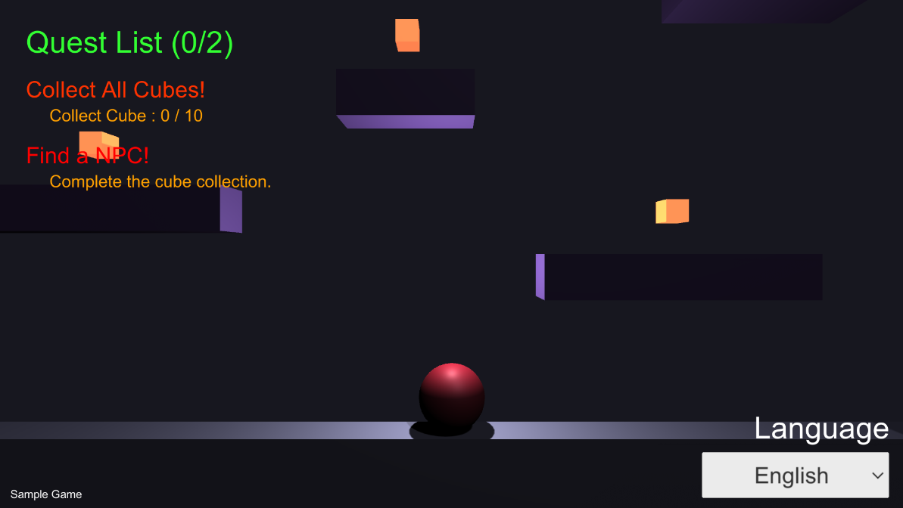

# Localizer Object

텍스트, 이미지, 오디오 등 실질적으로 게임에서 렌더링 되고 사운드를 재생하는 게임 오브젝트들에게 컴포넌트 형식으로 로컬라이징을 지원합니다. 이 컴포넌트들은 _LocalizerManager.SetLanguage_ 함수가 호출되면 해당 언어에 맞는 내용을 찾아 교체하게 됩니다.

언어에 따른 내용을 제외한 실질적인 내용이 변경되지 않는 오브젝트의 경우에 사용하기 적합합니다.

예제 게임에서의 Quest List, Sample Game, Language 등의 텍스트는 언어에 따라 고정된 내용으로 변하기 때문에 가장 적절한 예시입니다.

다만 퀘스트의 내용들 또한 **Text Localizer** 가 적용되어 있습니다. 이들은 _Use Script Only_가 활성화되어 있어 코 상에서 **Localized Dictionary**의 내용을 받아 텍스트를 변경합니다.

> ### Q. 컴포넌트를 어떻게 추가하죠?

Localizer 컴포넌트 들은 인스펙터상에서 _Add Component - Localizer_ 에서 추가하거나 또는 에디터 상단 메뉴에서 _Component - Localizer_ 에서 추가할 수 있습니다. **Localizer Manager** 에디터 윈도우를 사용 중이라면 Localizer 컴포넌트가 없는 오브젝트를 클릭 했을 때 Add Localizer 버튼이 활성화되고 현재 오브젝트에 부착된 컴포넌트에 해당되는 Localizer 가 자동적으로 추가됩니다.

> ### Q. 언제 사용하죠?

대부분의 Localizer 들은 언어를 제외한 텍스트의 내용이 고정되었을 때 사용합니다. 일반적으로 컴포넌트에서 언어별로 내용을 지정할 수 있어 별도의 스크립트 작성 없이 간단하게 사용할 수 있습니다.

**Text Localizer** 와 **TMP Localizer** 는 컴포넌트 그 자체적으로 언어 변경에 따라 폰트, 라인 스페이싱 등을 바꿀 수 있으며 기존의 고정된 형식의 내용 변경이 아닌 스크립트에서 직접 텍스트를 수정하는 것 또한 가능하기 때문에 사용 범위가 더 넓습니다.

각 Localizer 들에 대한 자세한 내용은 하위 목록에서 찾아볼 수 있습니다.

