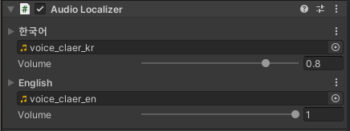

# Audio Localizer

The Localizer component used in AudioSource component.

## Component



| Properties |  |
| :--- | :--- |
| LClipData | Edit audio clip and volume of each language. It changes its component audio settings when language is changed. |

## Reference


```csharp
public class AudioLocalizer : LocalizerObject {    
    public class ClipData { }

    public UnityEngine.AudioSource Component { get; }
    
    public LClipData LClipData { get; set; }
    public UnityEngine.AudioClip Clip { get; }
    public float Volume { get; }
 
    public override bool SetComponent () { }
}
```


| Inner Class |  |
| :--- | :--- |
| [ClipData](clip-data.md) | Get information of audio clip and volume. |

| Value Definition |  |
| :--- | :--- |
| LClipData | [LValue&lt;T&gt;](../../../lvalue/lvalue-type.md) Wrapper class of [ClipData](clip-data.md) type. |

| Properties |  |
| :--- | :--- |
| Component | Get AudioSource component. |
| LClipData | Get or set [ClipData](clip-data.md) each language of the component. |
| Clip | Get clip value of component. |
| Volume | Get volume value of component. |

<table>
  <thead>
    <tr>
      <th style="text-align:left">Inherited Functions</th>
      <th style="text-align:left"></th>
    </tr>
  </thead>
  <tbody>
    <tr>
      <td style="text-align:left">SetComponent</td>
      <td style="text-align:left">
        <p>Fine and set AudioSource component.</p>
        <p>If it success, it&apos;s true and false it&apos;s not.</p>
      </td>
    </tr>
  </tbody>
</table>

