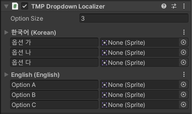

# TMP Dropdown Localizer

TMP\_Dropdown 컴포넌트에 사용되는 Localizer 컴포넌트 입니다.

## 컴포넌트



<table>
  <thead>
    <tr>
      <th style="text-align:left">Properties</th>
      <th style="text-align:left"></th>
    </tr>
  </thead>
  <tbody>
    <tr>
      <td style="text-align:left">Option Size</td>
      <td style="text-align:left">&#xD56D;&#xBAA9;&#xC758; &#xC218;&#xB97C; &#xC124;&#xC815;&#xD569;&#xB2C8;&#xB2E4;.</td>
    </tr>
    <tr>
      <td style="text-align:left">LOptions</td>
      <td style="text-align:left">
        <p>&#xC5B8;&#xC5B4;&#xBCC4; &#xB4DC;&#xB86D;&#xB2E4;&#xC6B4; &#xC635;&#xC158;&#xB4E4;&#xC744;
          &#xC9C0;&#xC815;&#xD569;&#xB2C8;&#xB2E4;.</p>
        <p>&#xC5B8;&#xC5B4;&#xAC00; &#xBCC0;&#xACBD;&#xB420; &#xACBD;&#xC6B0; &#xCEF4;&#xD3EC;&#xB10C;&#xD2B8;&#xC758;
          &#xC635;&#xC158;&#xB4E4;&#xC774; &#xBCC0;&#xACBD;&#xB41C; &#xC5B8;&#xC5B4;&#xC758;
          &#xC635;&#xC158;&#xB4E4;&#xB85C; &#xC124;&#xC815;&#xB429;&#xB2C8;&#xB2E4;.</p>
      </td>
    </tr>
  </tbody>
</table>

## 레퍼런스


```csharp
public class TMPDropdownLocalizer : DropdownLocalizerObject {
    public TMPro.TMP_Dropdown Component { get; }
    
    public override LocalizerOptionDataList Options { get }  
    public override bool SetComponent () { }
}
```


| Properties |  |
| :--- | :--- |
| Component | TMP Dropdown 컴포넌트를 가져옵니다. |

<table>
  <thead>
    <tr>
      <th style="text-align:left">Inherited Properties</th>
      <th style="text-align:left"></th>
    </tr>
  </thead>
  <tbody>
    <tr>
      <td style="text-align:left">Options</td>
      <td style="text-align:left">
        <p>TMP Dropdown&#xC758; options &#xAC12;&#xC744; LocalizerOptionDataList&#xB85C;</p>
        <p>&#xBCC0;&#xD658;&#xD558;&#xC5EC; &#xAC00;&#xC838;&#xC635;&#xB2C8;&#xB2E4;.</p>
      </td>
    </tr>
  </tbody>
</table>

<table>
  <thead>
    <tr>
      <th style="text-align:left">Inherited Functions</th>
      <th style="text-align:left"></th>
    </tr>
  </thead>
  <tbody>
    <tr>
      <td style="text-align:left">SetComponent</td>
      <td style="text-align:left">
        <p>TMP Dropdown &#xCEF4;&#xD3EC;&#xB10C;&#xD2B8;&#xB97C; &#xCC3E;&#xC544;
          &#xC124;&#xC815;&#xD569;&#xB2C8;&#xB2E4;.</p>
        <p>&#xC131;&#xACF5;&#xD558;&#xBA74; true, &#xADF8;&#xB807;&#xC9C0; &#xC54A;&#xC73C;&#xBA74;
          false &#xC785;&#xB2C8;&#xB2E4;.</p>
      </td>
    </tr>
  </tbody>
</table>

