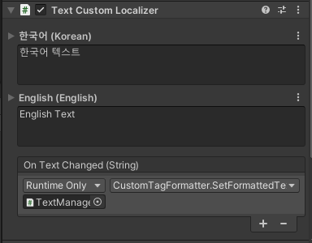

# Text Custom Localizer

The custom text Localizer component. It doesn't have a required component. When language is changed, **OnTextChanged** event has called instead of text changed.

## Component



| Properties |  |
| :--- | :--- |
| LText | Set text of each language. |
| OnTextChanged | Called with text parameter of changed language when language changed. |

## Reference


```csharp
public class TextCustomLocalizer : TextLocalizerObject {
    public class TextChangeEvent : UnityEvent<string> { }
    
    public TextChangeEvent OnTextChanged { get; }
    
    public override string Text { get }
    public override bool SetComponent () { }
}
```


| Inner Class |  |
| :--- | :--- |
| TextChangeEvent | UnityEvent&lt;T&gt; Wrapper class of string type. |

| Properties |  |
| :--- | :--- |
| OnTextChanged | It called with text of changed language when language changed. |

| Inherited Properties |  |
| :--- | :--- |
| Text | Get last applied text value. |

| Inherited Functions |  |
| :--- | :--- |
| SetComponent | It always return false because it does not require the component. |

