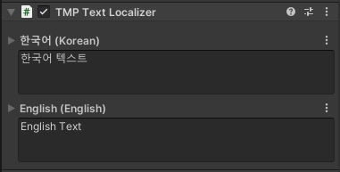

# TMP Text Localizer

The Localizer component used in TextMeshPro and TextMeshProUGUI component.

## Component



| Properties |  |
| :--- | :--- |
| LText | Edit text of each language. It changes its component text when language is changed. |

## Reference


```csharp
public class TMPTextLocalizer : TextLocalizerObject {
    public TMPro.TMP_Text Component { get; }

    public override string Text { get }  
    public override bool SetComponent () { }
}
```


| Properties |  |
| :--- | :--- |
| Component | Get TMP\_Text component. |

| Inherited Properties |  |
| :--- | :--- |
| Text | Get text of TMP\_Text component. |

<table>
  <thead>
    <tr>
      <th style="text-align:left">Inherited Functions</th>
      <th style="text-align:left"></th>
    </tr>
  </thead>
  <tbody>
    <tr>
      <td style="text-align:left">SetComponent</td>
      <td style="text-align:left">
        <p>Fine and set TMP_Text component.</p>
        <p>If it success, it&apos;s true and false it&apos;s not.</p>
      </td>
    </tr>
  </tbody>
</table>

