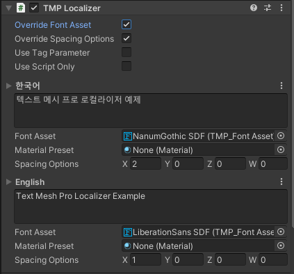

# TMP Localizer

## 사용 가능한 컴포넌트

**Text Mesh Pro** 및 **Text Mesh Pro UGUI** 에서 사용 가능합니다.

## 인스펙터 변수

## Override Font Asset

언어가 변경될 때 해당 언어에 지정된 폰트 에셋으로 변경합니다. 폰트 에셋이 지정되어 있지 않을 경우 기존의 폰트 에셋을 계속 사용합니다. 매트리얼 프리셋 또한 지정할 수 있으며 별도로 설정하지 않은 경우 폰트 에셋의 메인 매트리얼 프리셋을 사용합니다. 이 기능을 사용하면 각 언어마다 폰트 에셋과 매트리얼 프리셋 설정이 표시됩니다.

## Override Spacing Options

언어가 변경될 때 해당 언어에 지정된 스페이싱 옵션이 적용됩니다. 기본값들은 모두 0 입니다. 스페이싱 옵션은 순서대로 **x: character**, **y: word**, **z: line**, **w: paragraph** 입니다. 이 기능을 사용하면 각 언어마다 스페이싱 설정이 표시됩니다.

## Use Tag Parameter

텍스트 내에서 특정한 태그 기능을 사용합니다. 태그는 _TagManager.Tags_ 에 등록된 **TagParameterList** 에서 해당 키가 있을 경우에만 변환되며 그 외에는 텍스트 그대로 표시됩니다. 이는 **TMP Localizer** 를 통해 Text를 변경할 때 마다 검사되므로 불필요한 경우 꺼두는 것을 추천드립니다.

## Use Script Only

**TMP Localizer** 의 고정된 텍스트 변경 방식이 아닌 스크립트 상에서 Text를 직접 수정할 경우에 사용됩니다. 이 기능이 사용되면 언어가 변경되었을 때 텍스트가 변경되지 않으며 사용자가 코드 상으로 수정한 텍스트만을 표시합니다. 또한 언어별 텍스트 영역이 표시되지 않습니다.

## 내용 설정

언어가 변경되었을 때 각 언어에 해당되는 텍스트로 변경됩니다. **Override Font Asset** 혹은 **Override Spacing Options** 이 활성화되어 있다면 마찬가지로 언어가 변경되었을 때 적용됩니다.


폰트 에셋과스페이싱 옵션 오버라이딩의 경우에는 모든 **TMP Localizer** 마다 일일히 적용하는 것은 힘든 일 입니다. 이후에 서술될 **Localizer Manager** 에디터 윈도우를 사용하면 이러한 설정들의 기본값을 적용하여 컴포넌트가 생성되었을 때 자동으로 오버라이딩이 활성화, 폰트 에셋 또는 스페이싱 옵션을 언어별로 적용할 수 있습니다. 또한 이미 컴포넌트가 만들어진 경우라면 모든 **TMP Localizer**의 설정들을 일괄 변경할 수 있으니 현명한 선택을 하길 바랍니다.


