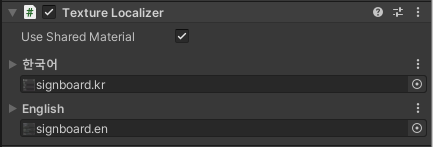

# Texture Localizer

## 사용 가능한 컴포넌트

**Mesh Renderer** 에서 사용 가능합니다.

## 인스펙터 변수

## Use Shared Material

**sharedMaterial** 의 **mainTexture**를 변경합니다. 이 작업은 매트리얼을 공유하는 모든 렌더러들에게 영향을 줍니다. 기본값은 true 입니다. 비활성화 시 렌더러의 인스턴스 material 의 texture를 변경합니다. **이 작업은 에디터 상태에서는 이루어지지 않으며 비활성화를 권장하지 않습니다.**

## 내용 설정

언어가 변경되었을 때 각 언어에 해당되는 텍스처가 현재 **Mesh Renderer**에 적용됩니다.


**Use Shared Material**을 비활성화 한다면 에디터 상태에서는 언어를 변경할 수 없습니다. 이는 유니티 자체적으로 에디터 상태에서 인스턴스 material 을 생성할 시 경고를 표시하기 때문입니다.


