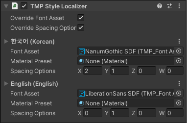

# TMP Style Localizer

TextMeshPro, TextMeshProUGUI, TMP\_Dropdown 컴포넌트에 사용되는 Localizer Style 컴포넌트 입니다.

## 컴포넌트



| Properties |  |
| :--- | :--- |
| OverrideFontAsset | 언어가 변경될 때 해당 언어에 지정된 폰트 에셋으로 변경합니다. 폰트 에셋이 지정되어 있지 않을 경우 기존의 폰트 에셋과 매트리얼 프리셋을 계속 사용합니다. 이 기능을 사용면 각 언어마다 Font Asset 및 Material Preset 설정이 표시됩니다. \(참고: Material Preset이 없다면 폰트 에셋의 메인 매트리얼 프리셋을 사용합니다.\) |
| OverrideSpacingOptions | 언어가 변경될 때 해당 언어에 지정된 스페이싱 옵션들로 변경합니다. 이 기능을 사용면 각 언어마다 스페이싱 옵션들이 표시됩니다. |
| LStyleData | 언어별 스타일을 지정합니다. 언어가 변경될 경우 컴포넌트의 폰트 에셋, 매트리얼 프리셋 및 스페이싱 옵션들이 변경된 언어의 스타일로 설정됩니다. |

## 레퍼런스


```csharp
public class TMPStyleLocalizer : LocalizerObject {
    public struct SpacingOption { }
    public class StyleData { }

    public LTMPStyleData LStyleData { get; set; }
    public bool OverrideFontAsset { get; set; }
    public bool OverrideSpacingOptions { get; set; }
    
    public TMPro.TMP_FontAsset FontAsset { get; }
    public UnityEngine.Material FontSharedMaterial { get; }
    public SpacingOption SpacingOptions { get; }
 
    public override bool SetComponent () { }
}
```


| Inner Struct |  |
| :--- | :--- |
| [SpacingOption](spacing-option.md) | Text Mesh Pro Text의 스페이싱 옵션들을 가집니다. |

| Inner Class |  |
| :--- | :--- |
| [StyleData](style-data.md) | 폰트 에셋, 매트리얼 프리셋 및 스페이싱 옵션들의 정보를 가집니다. |

| Value Definition |  |
| :--- | :--- |
| LTMPStyleData | [TMPStyleLocalizer.StyleData](style-data.md) 타입의 LValue&lt;T&gt; Wrapper 클래스입니다. |

| Properties |  |
| :--- | :--- |
| LStyleData | 컴포넌트의 언어별 [StyleData](style-data.md)를 가져오거나 변경합니다. |
| OverrideFontAsset | 언어가 변경될 때 해당 언어에 지정된 폰트 에셋으로 변경합니다. 폰트 에셋이 지정되어 있지 않을 경우 기존의 폰트 에셋과 매트리얼 프리셋을 계속 사용합니다. \(참고: Material Preset이 없다면 폰트 에셋의 메인 매트리얼 프리셋을 사용합니다.\) |
| OverrideSpacingOptions | 언어가 변경될 때 해당 언어에 지정된 스페이싱 옵션들로 변경합니다.  |
| FontAsset | 컴포넌트의 font 값을 가져옵니다. |
| FontSharedMaterial | 컴포넌트의 fontSharedMaterial 값을 가져옵니다. |
| SpacingOptions | 컴포넌트의 각 스페이싱 옵션 값들을 [SpacingOption](spacing-option.md) 구조체로 가져옵니다. TMP\_Dropdown 에는 해당되지 않습니다. |

<table>
  <thead>
    <tr>
      <th style="text-align:left">Inherited Functions</th>
      <th style="text-align:left"></th>
    </tr>
  </thead>
  <tbody>
    <tr>
      <td style="text-align:left">SetComponent</td>
      <td style="text-align:left">
        <p>Text Mesh Pro &#xAD00;&#xB828; &#xCEF4;&#xD3EC;&#xB10C;&#xD2B8;&#xB97C;
          &#xCC3E;&#xC544; &#xC124;&#xC815;&#xD569;&#xB2C8;&#xB2E4;.</p>
        <p>&#xC131;&#xACF5;&#xD558;&#xBA74; true, &#xADF8;&#xB807;&#xC9C0; &#xC54A;&#xC73C;&#xBA74;
          false &#xC785;&#xB2C8;&#xB2E4;.</p>
      </td>
    </tr>
  </tbody>
</table>

