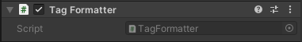
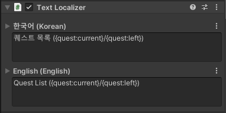

# Tag Formatter

**Text Localizer Object**, UGUI Text, TextMesh, TextMeshPro, TextMeshProUGUI에 사용되는 텍스트 내의 태그를 특정 문자열로 대체하는 컴포넌트입니다.


**Text Localizer Object** 컴포넌트와 같이 사용할 경우 추가 작업 필요 없이 기존의 LText 수정 방식으로 사용하면 되며, Localizer 없이 사용한다면 **Tag Formatter** 의 Format 값을 설정하여 사용할 수 있습니다.

**Tag Parameter** 기능을 사용하기 위해서는 **Tag Manager** 에 **Tag Parameter List**가 등록되어 있어야 합니다. **Tag Formatter**는 등록된 **Tag Parameter List**에서 **Tag Parameter**들을 참조하여 텍스트 내의 태그를 **Tag Parameter**의 값으로 변경합니다. **Tag Parameter**가 없을 경우 텍스트가 변경되지 않습니다.


## 컴포넌트



수정 가능한 항목이 없습니다.


LText 혹은 Text 값이 변경되면 텍스트에 포함된 태그를 참조하여 내부에서 **Tag Parameter**들을 캐싱하게 됩니다. 이 때 **Tag Parameter**의 값이 변경되면 자동적으로 Refresh가 이루어집니다.


## 태그 작성 형식



기본적인 태그 작성 방법은 {} 내부에 태그 참조 \(Tag Reference\)를 작성합니다. 태그 참조는 List의 엑세스키 다음 : 을 붙이고 **Tag Parameter**의 키를 작성합니다. **Tag Parameter**가 배열 형식인 경우 키 뒤에 인덱서와 함께 인덱스를 추가로 붙입니다.

* 태그 참조 예시
* 일반 형식 : {accessKey:parameterKey}
* 배열 형식 : {accessKey:parameterKey\[index\]}

태그 작성의 예로 "quest" 라는 엑세스 키를 가진 **Tag Parameter List**가 있으며, List 안에는 "current" 와 "left" 라는 키를 가진 **Tag Parameter**가 있다면 위 예시처럼 사용할 수 있습니다.

## 레퍼런스


```csharp
public class TagFormatter : MonoBehaviour {    
    public string Text { get; set; }
    public Format { get; set; }
    
    public void SetTextComponent () { }
    public void Refresh () { }
    
    public static string FormatToText (string format) { }
    public static string FormatToText (List<TagParameter> tags, string format) { }
}
```


| Properties |  |
| :--- | :--- |
| Text | 컴포넌트의 text 값을 가져오거나 설정합니다. |
| Format | 태그 포맷이 적용된 텍스트를 가져오거나 컴포넌트 text 값을 설정합니다. |

| Functions |  |
| :--- | :--- |
| SetTextComponent | Localizer 혹은 Text 관련 컴포넌트를 찾아 설정합니다. |
| Refresh | 현재 설정된 포맷으로 컴포넌트의 text를 업데이트합니다. \(참고 : 태그의 값이 변경되면 자동적으로 호출됩니다.\) |

| Static Functions |  |
| :--- | :--- |
| FormatToText | 입력된 format 에서 태그가 문자열로 대체된 텍스트를 가져옵니다. |

