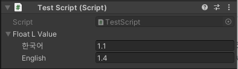

# Add Custom Type

The way using new type instead of already defined **LValue&lt;T&gt;** Wrapper class.


Script Reference is support over unity 2019.3 version. **LValue&lt;T&gt;** can be serialized without extra Wrapper class.


## Used by Script Reference

```csharp
using UnityEngine;
using LocalizerPlus;

public class TestScript : MonoBehaviour {
    public LValue<float> floatLValue;
}
```



This function doesn't support under 2019.2 version, so you have to write Wrapper class and property drawer.

## Write Wrapper Class

```csharp
using LocalizerPlus;

[System.Serializable]
public class LFloat : LValue<float> {
    public LFloat () : base () { }
    public LFloat (LFloat value) : base (value) { }
    public LFloat (float[] values) : base (values) { }
}
```

Wrapper class have to inherit **LValue&lt;T&gt;** and write 3 default constructors with System.Serializable attribute. The Type of T must be serialized type in unity. You can use Sytem.Serializable if type is struct or class.

## Write Property Drawer

Property drawer is function of UnityEditor. The script must be in Editor folder to work normally. This is the way of inherit existing **LValueDrawer** used in **LValue&lt;T&gt;**.

```csharp
using UnityEditor;
using LocalizerPlus;

[CustomPropertyDrawer (typeof (LFloat))]
public class LFloatDrawer : LValueDrawer { }
```


Drawing by **LValueDrawer** is work normally if fields of each language are has single line height. It is corresponded to int, float, bool and object reference, and It is not applied to foldout that used elements Vector4, array, list, serialized struct or class.


**LValueDrawer** is limited drawer. If you want to draw more various types, you have to draw it by inherit PropertDrawer.

