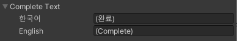
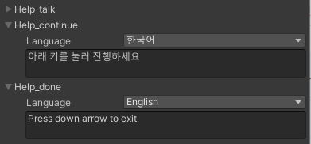

# LValue&lt;T&gt;

언어별로 특정한 값이나 오브젝트 레퍼런스를 다르게 사용하고 싶을 때 사용하는 제네릭 클래스 입니다. **LString, LSprite, LOptionDataList** 등 다양한 로컬라이저에서 사용되며 **LString**은 **Localized Dictionary, Tag Parameter** 에서도 사용됩니다.



미리 정의된 **LValue&lt;T&gt;** Wrapper 클래스들은 클래스명 앞에 "L"이 붙어 있으며 커스텀 프로퍼티 드로워가 적용되어 일반적인 형태로 사용할 수 있는 형식의 경우 인스펙터에 시리얼라이징이 됩니다. 로컬라이저 컴포넌트에서 사용되는 경우에는 컴포넌트 마다 별도의 커스텀 인스펙터가 적용되어 시리얼라이징 됩니다.

## 정의된 Wrapper 클래스

**Localized Dictionary** 및 로컬라이저에 사용되기 위해 미리 정의된 **LValue&lt;T&gt;** Wrapper 클래스들 입니다.

| Class | Type | Serialize |
| :--- | :--- | :--- |
| LString | LValue&lt;string&gt; | Yes |
| LSprite | LValue&lt;Sprite&gt; | Yes |
| LOptionDataList | LValue&lt;LocalizerOptionDataList&gt; | No |
| LClipData | LValue&lt;AudioLocalizer.ClipData&gt; | No |
| LTexture | LValue&lt;Texture&gt; | Yes |
| LTextStyleData | LValue&lt;TextStyleLocalizer.StyleData&gt; | No |
| LTMPStyleData | LValue&lt;TMPStyleLocalizer.StyleData&gt; | No |


인스펙터 시리얼라이징은 T 형식이 시리얼라이징이 가능한 형식이며 한 줄 높이 \(EditorGUIUtility.singleLineHeight\) 인 경우에만 적용됩니다.

위 Serialize 여부는 단순 인스펙터 노출의 의미이며 실제 값들은 정상적으로 저장됩니다.


## LStringTextArea 어트리뷰트

로컬라이징은 주로 텍스트로 이루어지기 때문에 string의 역할은 중요합니다. 일반 텍스트 필드가 아닌 텍스트 영역으로 표시할 때 **LStringTextArea** 어트리뷰트를 사용합니다.


```csharp
public class LStringTextAreaAttribute : PropertyAttribute {
    public LStringTextAreaAttribute (int height) { }
}
```


| Constructor |  |
| :--- | :--- |
| LStringTextAreaAttribute | 지정된 높이 만큼의 텍스트 영역을 그립니다. 최소 1, 최대 50 입니다. |


아래의 예시는 Cube Collector 예제에서 사용된 GameManager의 스크립트와 인스펙터의 일부입니다.


```csharp
public class GameManager : MonoBehaviour {
    [SerializeField, LStringTextArea (2)] LString help_talk = null;
    [SerializeField, LStringTextArea (2)] LString help_continue = null;
    [SerializeField, LStringTextArea (2)] LString help_done = null;
}
```




Language Label 우측의 콤보 박스로 언어별 string 값을 지정할 수 있습니다.

## 레퍼런스


```csharp
public class LValue<T> {
    public LValue () { }
    public LValue (LValue<T> value) { }
    public LValue (T[] value) { }
    
    public T this[string language] { get; set; }
    public T this[UnityEngine.SystemLanguage language] { get; set; }
    public T this[int index] { get; set; }
    
    public int Count { get; }
    public T Value { get; set; }

    public override string ToString () { }
}
```


| Constructor |  |
| :--- | :--- |
| LValue | LValue&lt;T&gt;, T 배열로 부터 또는 빈 LValue를 생성합니다. |

| Indexer |  |
| :--- | :--- |
| this | LanguageText, SystemLanguage 또는 인덱스로부터 값을 가져오거나 설정합니다. |

| Properties |  |
| :--- | :--- |
| Count | 현재 값의 수를 가져옵니다. 언어가 업데이트 되지 않은 경우 언어의 수와 다를 수 있습니다. |
| Value | 현재 언어의 값을 가져오거나 설정합니다. |

| Inherits Functions |  |
| :--- | :--- |
| ToString | 현재 언어 값의 ToString 된 값을 가져옵니다. |

