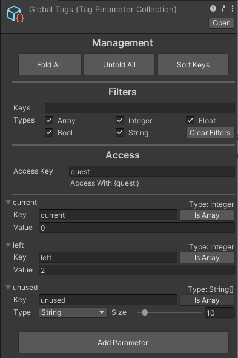

# Tag Parameter Collection

The collection scriptable object has **Parameter Data** that define **Tag Parameter**. It used for define **Tag Parameters** in editor and load **Tag Parameter List** in runtime to register to **Tag Manager**. After loaded, the asset should be released from memory.

You can create **Tag Parameter Collection** by _right click - Create - Localizer Plus - Tag Parameter Collection_ in project.

## Scriptable Object



| Management |  |
| :--- | :--- |
| Fold All | Close all [ParameterData](parameter-data.md) elements. |
| Unfold All | Open all [ParameterData](parameter-data.md) elements. |
| Sort Keys | Sort [ParameterData](parameter-data.md) elements by key. |

| Filters |  |
| :--- | :--- |
| Keys | Displays elements only contains specific keyword. |
| Filter | Displays type of elements. |
| Clear Filters | Reset all filters. |

| Access |  |
| :--- | :--- |
| Access Key | The access key of [TagParameterList](../tag-parameter-list/). |

| Parameter Data |  |
| :--- | :--- |
| Expected Type | The parameter type when element is loaded. |
| Key | The key of [TagParameter](../tag-parameter-list/tag-parameter.md) when accessed. |
| Value | The value of [TagParameter](../tag-parameter-list/tag-parameter.md). |
| Is Array | Whether [TagParameter](../tag-parameter-list/tag-parameter.md) is array or not. |
| Type | The array type of [TagParameter](../tag-parameter-list/tag-parameter.md). |
| Size | The array size of [TagParameter](../tag-parameter-list/tag-parameter.md). |


**Expected Type** of **Parameter Data** is displayed in right side of Foldout Label, and It affected by Value, Is Array, Type. **LString** can not be used in **Tag Parameter Collection**.


## Reference


```csharp
public class TagParameterCollection : ScriptableObject {
    public string accessKey;
    public List<ParameterData> datas;

    public TagParameterList void Load (bool unloadOnComplete = true) { }
}
```


| Variables |  |
| :--- | :--- |
| accessKey | The access key of loaded [TagParameterList](../tag-parameter-list/). |
| datas | The list of [ParameterData](parameter-data.md). |

| Functions |  |
| :--- | :--- |
| Load | Convert [ParameterData](parameter-data.md) to [TagParameter](../tag-parameter-list/tag-parameter.md) and create [TagParameterList](../tag-parameter-list/) with access key to register to [TagManager](../tag-manager/). After load complete, It calls Resources.UnloadAsset to release the asset if unloadOnComplete is true. It returns loaded [TagParameterList](../tag-parameter-list/). Return null If access key is already exist or empty. |

