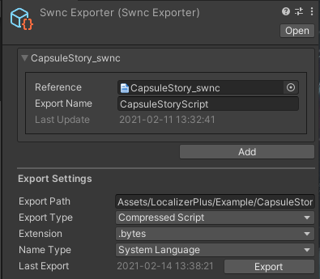

# Swnc Exporter

**Script Writer** can export only a file of specific language or **Localized Dictionary** at once. It is cumbersome work to export each language. And if you have many swnc file, It takes more time.

**Swnc Exporter** is a scriptable object that can export swnc files to a specific folder with using export settings. The export type supports **Script, Compressed Script, Localized Dictionary**. And **Script, Compressed Script** creates a folder that has files of each language.

## File Information

Setting swnc file and file exported file name. You can add element by clicking "Add" button in bottom. And you can open or remove the element by clicking right click the Label.

| File Info |  |
| :--- | :--- |
| Reference | Export target asset. Only can assign swnc extension file. |
| Export Name | Folder name or file name when exported. |
| Last Update | The last update date of swnc file. |

## Export Settings

Settings for exportation. Setting export target folder, export type and extension, name type. The extension is changed by export type.

| Export Settings |  |
| :--- | :--- |
| Export Path | Export target folder. |
| Export Type | Exported file type. |
| Extension | Exported file extension. |
| Name Type | Exported file name type. |
| Last Export | Last export date. |
| Export | Execute exportation. |


.scrt and .cscrt extension are displayed the content in inspector by clicking file. These are loaded from File static class or used in StreamReader. If you use Resources folder, you have to save with .txt or .bytes extension.

Name type has LanguageText and SystemLanguage. LanguageText is the name of language that developer written and SystemLanguage is language type supported by Unity. If you use SystemLanguage, It uses English named language name.


